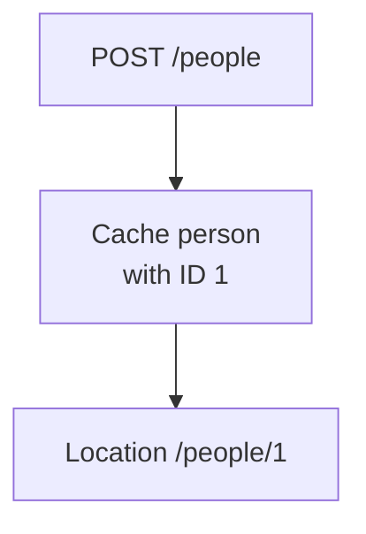
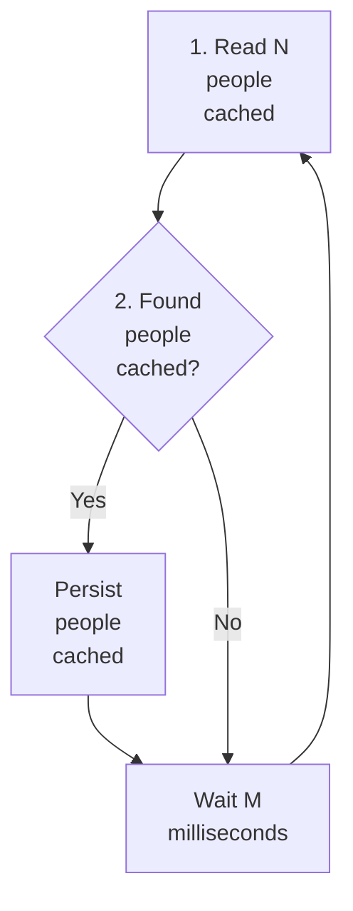
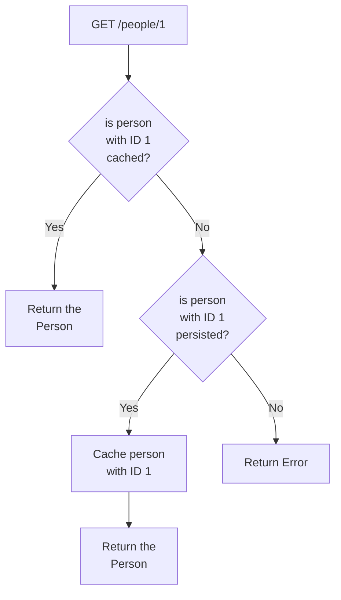

# POC: Redis Cache Write Back Strategy

It demonstrates how to implement caching based on write back strategy using Redis.

We want to implement a Web Service that allows us to create a person and find it by the random ID generated to the
person after persisting it on a Postgres relational database. The goal is to cache the person first and run a background
task every M milliseconds that find every people cached and write them back to the relational database. This behavior
was implemented using a scheduler managed by Spring Framework and by caching people twice, one time in by the unique ID
and second time serializing the person to JSON and adding it to a set which the scheduler logic will pop them depending
on whether it could be persisted in the relational database or not.

To avoid writing abstractions and boilerplate code, we are going to depend on Spring MVC for the Web layer, Spring Data
JPA for persistence on relational database and Spring Data Redis for caching. The source code should be evaluated using
automated tests with database containers provisioned by TestContainers and tests managed by JUnit.

Other approaches to cache are [Write Through](https://github.com/lucasvalenteds/poc-redis-cache-write-through)
and [Cache Aside](https://github.com/lucasvalenteds/poc-redis-cache-aside).

## How to run

| Description | Command          |
|:------------|:-----------------|
| Run tests   | `./gradlew test` |

## Preview

Write Back Strategy write execution flow:



Write Back Strategy scheduler execution flow:



Write Back Strategy read execution flow:



Logging output after waiting M milliseconds:

```text
-07-09T14:11:36.153-03:00  INFO 39412 --- [   scheduling-1] com.example.person.PersonServiceDefault  : Found 10 people to write back from cache to database
2022-07-09T14:11:36.182-03:00  INFO 39412 --- [   scheduling-1] com.example.person.PersonServiceDefault  : Person saved (person=Person(id=c511fbb9-a155-4651-8da6-d55b97ddad39, name=John Smith, age=45))
2022-07-09T14:11:36.186-03:00  INFO 39412 --- [   scheduling-1] com.example.person.PersonServiceDefault  : Person removed from person:write_back set (person=Person(id=c511fbb9-a155-4651-8da6-d55b97ddad39, name=John Smith, age=45))
2022-07-09T14:11:36.189-03:00  INFO 39412 --- [   scheduling-1] com.example.person.PersonServiceDefault  : Person saved (person=Person(id=7b0f0e3e-e241-430d-b49d-15a6c1d30ca6, name=John Smith, age=45))
2022-07-09T14:11:36.190-03:00  INFO 39412 --- [   scheduling-1] com.example.person.PersonServiceDefault  : Person removed from person:write_back set (person=Person(id=7b0f0e3e-e241-430d-b49d-15a6c1d30ca6, name=John Smith, age=45))
2022-07-09T14:11:36.192-03:00  INFO 39412 --- [   scheduling-1] com.example.person.PersonServiceDefault  : Person saved (person=Person(id=371d0e87-3666-446b-b12b-148f28a52c58, name=John Smith, age=45))
2022-07-09T14:11:36.193-03:00  INFO 39412 --- [   scheduling-1] com.example.person.PersonServiceDefault  : Person removed from person:write_back set (person=Person(id=371d0e87-3666-446b-b12b-148f28a52c58, name=John Smith, age=45))
2022-07-09T14:11:36.195-03:00  INFO 39412 --- [   scheduling-1] com.example.person.PersonServiceDefault  : Person saved (person=Person(id=95dfb75b-94f0-42a2-adcf-a8131d91beb9, name=John Smith, age=45))
2022-07-09T14:11:36.196-03:00  INFO 39412 --- [   scheduling-1] com.example.person.PersonServiceDefault  : Person removed from person:write_back set (person=Person(id=95dfb75b-94f0-42a2-adcf-a8131d91beb9, name=John Smith, age=45))
2022-07-09T14:11:36.197-03:00  INFO 39412 --- [   scheduling-1] com.example.person.PersonServiceDefault  : Person saved (person=Person(id=50f86336-0b81-4812-918a-7d00f6577da9, name=John Smith, age=45))
2022-07-09T14:11:36.198-03:00  INFO 39412 --- [   scheduling-1] com.example.person.PersonServiceDefault  : Person removed from person:write_back set (person=Person(id=50f86336-0b81-4812-918a-7d00f6577da9, name=John Smith, age=45))
2022-07-09T14:11:36.200-03:00  INFO 39412 --- [   scheduling-1] com.example.person.PersonServiceDefault  : Person saved (person=Person(id=21322dfe-d5c2-45b4-b32b-5ad680551f96, name=John Smith, age=45))
2022-07-09T14:11:36.200-03:00  INFO 39412 --- [   scheduling-1] com.example.person.PersonServiceDefault  : Person removed from person:write_back set (person=Person(id=21322dfe-d5c2-45b4-b32b-5ad680551f96, name=John Smith, age=45))
2022-07-09T14:11:36.202-03:00  INFO 39412 --- [   scheduling-1] com.example.person.PersonServiceDefault  : Person saved (person=Person(id=319ca5d0-9b25-4fac-9df7-177954e764ee, name=John Smith, age=45))
2022-07-09T14:11:36.203-03:00  INFO 39412 --- [   scheduling-1] com.example.person.PersonServiceDefault  : Person removed from person:write_back set (person=Person(id=319ca5d0-9b25-4fac-9df7-177954e764ee, name=John Smith, age=45))
2022-07-09T14:11:36.205-03:00  INFO 39412 --- [   scheduling-1] com.example.person.PersonServiceDefault  : Person saved (person=Person(id=aa01c62e-09e9-4cfb-8969-676a4772b2ec, name=John Smith, age=45))
2022-07-09T14:11:36.205-03:00  INFO 39412 --- [   scheduling-1] com.example.person.PersonServiceDefault  : Person removed from person:write_back set (person=Person(id=aa01c62e-09e9-4cfb-8969-676a4772b2ec, name=John Smith, age=45))
2022-07-09T14:11:36.207-03:00  INFO 39412 --- [   scheduling-1] com.example.person.PersonServiceDefault  : Person saved (person=Person(id=08277765-c2f8-48bc-8c9a-e99c5f4f952c, name=John Smith, age=45))
2022-07-09T14:11:36.207-03:00  INFO 39412 --- [   scheduling-1] com.example.person.PersonServiceDefault  : Person removed from person:write_back set (person=Person(id=08277765-c2f8-48bc-8c9a-e99c5f4f952c, name=John Smith, age=45))
2022-07-09T14:11:36.209-03:00  INFO 39412 --- [   scheduling-1] com.example.person.PersonServiceDefault  : Person saved (person=Person(id=dbb3c6d2-7f6c-44bf-b148-c76589e79365, name=John Smith, age=45))
2022-07-09T14:11:36.210-03:00  INFO 39412 --- [   scheduling-1] com.example.person.PersonServiceDefault  : Person removed from person:write_back set (person=Person(id=dbb3c6d2-7f6c-44bf-b148-c76589e79365, name=John Smith, age=45))
2022-07-09T14:11:36.210-03:00  INFO 39412 --- [   scheduling-1] com.example.person.PersonServiceDefault  : Persisted 10 people in the database
2022-07-09T14:11:37.153-03:00  INFO 39412 --- [   scheduling-1] com.example.person.PersonServiceDefault  : None people to write back from cache to database
```

Logging output after creating a person:

```text
2022-07-09T14:11:35.522-03:00  INFO 39412 --- [o-auto-1-exec-1] com.example.person.PersonServiceDefault  : Person cached (key=95dfb75b-94f0-42a2-adcf-a8131d91beb9, value=Person(id=95dfb75b-94f0-42a2-adcf-a8131d91beb9, name=John Smith, age=45))
2022-07-09T14:11:35.554-03:00  INFO 39412 --- [o-auto-1-exec-2] com.example.person.PersonServiceDefault  : Person cached (key=21322dfe-d5c2-45b4-b32b-5ad680551f96, value=Person(id=21322dfe-d5c2-45b4-b32b-5ad680551f96, name=John Smith, age=45))
2022-07-09T14:11:35.563-03:00  INFO 39412 --- [o-auto-1-exec-3] com.example.person.PersonServiceDefault  : Person cached (key=7b0f0e3e-e241-430d-b49d-15a6c1d30ca6, value=Person(id=7b0f0e3e-e241-430d-b49d-15a6c1d30ca6, name=John Smith, age=45))
2022-07-09T14:11:35.572-03:00  INFO 39412 --- [o-auto-1-exec-4] com.example.person.PersonServiceDefault  : Person cached (key=aa01c62e-09e9-4cfb-8969-676a4772b2ec, value=Person(id=aa01c62e-09e9-4cfb-8969-676a4772b2ec, name=John Smith, age=45))
2022-07-09T14:11:35.580-03:00  INFO 39412 --- [o-auto-1-exec-5] com.example.person.PersonServiceDefault  : Person cached (key=319ca5d0-9b25-4fac-9df7-177954e764ee, value=Person(id=319ca5d0-9b25-4fac-9df7-177954e764ee, name=John Smith, age=45))
2022-07-09T14:11:35.588-03:00  INFO 39412 --- [o-auto-1-exec-6] com.example.person.PersonServiceDefault  : Person cached (key=50f86336-0b81-4812-918a-7d00f6577da9, value=Person(id=50f86336-0b81-4812-918a-7d00f6577da9, name=John Smith, age=45))
2022-07-09T14:11:35.595-03:00  INFO 39412 --- [o-auto-1-exec-7] com.example.person.PersonServiceDefault  : Person cached (key=dbb3c6d2-7f6c-44bf-b148-c76589e79365, value=Person(id=dbb3c6d2-7f6c-44bf-b148-c76589e79365, name=John Smith, age=45))
2022-07-09T14:11:35.603-03:00  INFO 39412 --- [o-auto-1-exec-8] com.example.person.PersonServiceDefault  : Person cached (key=08277765-c2f8-48bc-8c9a-e99c5f4f952c, value=Person(id=08277765-c2f8-48bc-8c9a-e99c5f4f952c, name=John Smith, age=45))
2022-07-09T14:11:35.612-03:00  INFO 39412 --- [o-auto-1-exec-9] com.example.person.PersonServiceDefault  : Person cached (key=371d0e87-3666-446b-b12b-148f28a52c58, value=Person(id=371d0e87-3666-446b-b12b-148f28a52c58, name=John Smith, age=45))
2022-07-09T14:11:35.622-03:00  INFO 39412 --- [-auto-1-exec-10] com.example.person.PersonServiceDefault  : Person cached (key=c511fbb9-a155-4651-8da6-d55b97ddad39, value=Person(id=c511fbb9-a155-4651-8da6-d55b97ddad39, name=John Smith, age=45))
```

Logging output after finding the person by ID multiple times:

```text
2022-07-09T14:11:35.634-03:00  INFO 39412 --- [o-auto-1-exec-1] com.example.person.PersonServiceDefault  : Person retrieved from cache (personId=c511fbb9-a155-4651-8da6-d55b97ddad39)
2022-07-09T14:11:35.652-03:00  INFO 39412 --- [o-auto-1-exec-2] com.example.person.PersonServiceDefault  : Person retrieved from cache (personId=c511fbb9-a155-4651-8da6-d55b97ddad39)
2022-07-09T14:11:35.660-03:00  INFO 39412 --- [o-auto-1-exec-3] com.example.person.PersonServiceDefault  : Person retrieved from cache (personId=c511fbb9-a155-4651-8da6-d55b97ddad39)
2022-07-09T14:11:35.668-03:00  INFO 39412 --- [o-auto-1-exec-4] com.example.person.PersonServiceDefault  : Person retrieved from cache (personId=c511fbb9-a155-4651-8da6-d55b97ddad39)
2022-07-09T14:11:35.676-03:00  INFO 39412 --- [o-auto-1-exec-5] com.example.person.PersonServiceDefault  : Person retrieved from cache (personId=c511fbb9-a155-4651-8da6-d55b97ddad39)
2022-07-09T14:11:35.683-03:00  INFO 39412 --- [o-auto-1-exec-6] com.example.person.PersonServiceDefault  : Person retrieved from cache (personId=c511fbb9-a155-4651-8da6-d55b97ddad39)
2022-07-09T14:11:35.691-03:00  INFO 39412 --- [o-auto-1-exec-7] com.example.person.PersonServiceDefault  : Person retrieved from cache (personId=c511fbb9-a155-4651-8da6-d55b97ddad39)
2022-07-09T14:11:35.699-03:00  INFO 39412 --- [o-auto-1-exec-8] com.example.person.PersonServiceDefault  : Person retrieved from cache (personId=c511fbb9-a155-4651-8da6-d55b97ddad39)
2022-07-09T14:11:35.707-03:00  INFO 39412 --- [o-auto-1-exec-9] com.example.person.PersonServiceDefault  : Person retrieved from cache (personId=c511fbb9-a155-4651-8da6-d55b97ddad39)
2022-07-09T14:11:35.714-03:00  INFO 39412 --- [-auto-1-exec-10] com.example.person.PersonServiceDefault  : Person retrieved from cache (personId=c511fbb9-a155-4651-8da6-d55b97ddad39)
```
